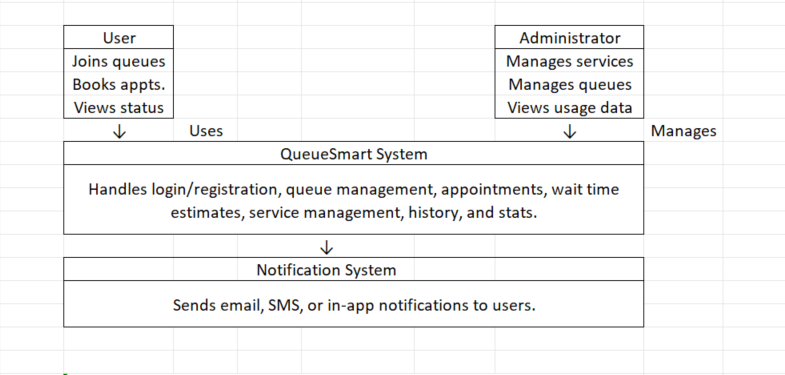
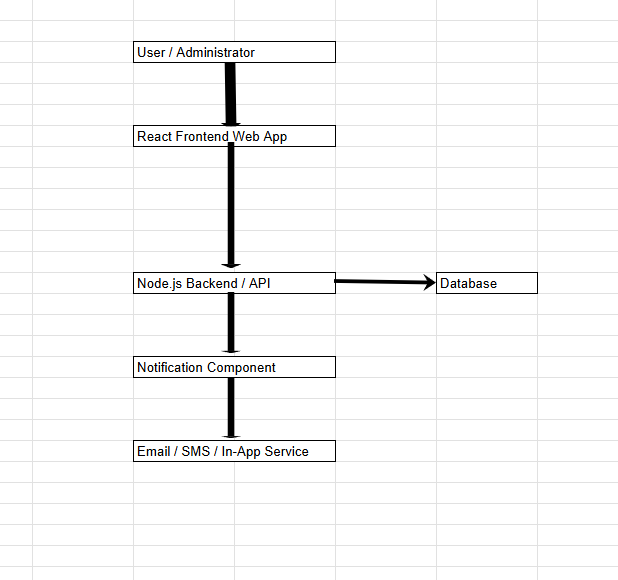

## **Problem Statement**

Many organizations (student service centers, clinics, advising offices, help desks) struggle with long queues and poor visibility into wait times. Users often do not know how long they will wait, and staff have limited tools to manage demand efficiently.

Your team will design **QueueSmart**, a web or mobile application that helps:

### Users

- Join a queue or book an appointment
    
- View their position and estimated wait time
    
- Receive notifications when their turn is approaching
    

### Administrators

- Create and manage services
    
- Monitor queues and priorities
    
- Improve overall service efficiency
    

---

## **Application Requirements**

Your QueueSmart application must include the following components:

### **1. Login and Registration**

- Allow users and administrators to register
    
- Basic authentication using username/email and password
    
- Email verification (design only)
    

### **2. User Roles**

- **User:** Join queues, view status, receive notifications
    
- **Administrator:** Create services, manage queues, view usage data
    

### **3. Service Management (Admin)**

Administrators can create services and define:

- Service name and description
    
- Expected service duration
    
- Priority level (low / medium / high)
    

### **4. Queue Management**

- Users can join or leave a queue
    
- Users can view:
    
    - Current position in the queue
        
    - Estimated wait time
        
- Queue ordering is based on arrival time and priority
    

### **5. Notifications**

- Notify users when:
    
    - They are close to being served
        
    - Queue status changes
        
- Notifications may be email or in-app (design choice)
    

### **6. History**

- Track user queue participation history
    
- Administrators can view basic usage statistics
    

> **Note:** Teams may choose to design either a **web application or a mobile application** using any tools or technologies they prefer.

---

## **Questions to Answer**

---

### **1. Initial Thoughts (2 points)**

Discuss your initial thoughts on designing QueueSmart:

- Who are the main users of the system?
    The main users will be any service providing organizations that require placing clients in a queue. Within the organization, there are two types of main users: Administrators and Users. 
    
- How will users and administrators interact with the application?
	Administrators have permission to create, manage, and view the status of the entire queue. Users have permission to book appointments, view their position in the queue, see an estimated wait time, and will recieve notifications when they are next to be processed. 

- What are the most important features?
	Some important features include the actual queueing logic itself, account creation and management, the notification system, user history, user roles, admin roles, and admin servicing management.  
    
- What challenges do you anticipate (e.g., long queues, notifications, inaccurate wait times)?
	A challenge that I'm anticipating is creating user and admin roles priveleges. From a security standpoint, users should obviously not be able to execute any actions exclusive to admins. Another challenge that we expect to face could be dynamically changing user priorities in an active queue, and figuring out how those priority changes would affect the rest of the queue. Another challenge is keeping estimated wait times accurate. Wait times may change depending on many factors such as how long each service takes, and whether priority users are added to the queue. Finally, another challenge is notification reliability. Users need to recieve notification at the right time, especially when their turn is approaching.
---

### **2. Development Methodology (2 points)**

Discuss the development methodology your team plans to use:

- Which methodology will you follow (e.g., Agile, Scrum, Waterfall)?
  	We will be using Agile methodology using the Scrum framework. Development will be broken into short sprints.
    
- Why is this methodology appropriate for this project?
    Agile is appropriate because requirements may evolve as we build and test. Scrum lets us deliver features incrementally, starting with core functionality like authentication and queuing, then adding notifications and dashboards later.
  
- How will this approach help your team work across multiple assignments?
    Each assignment submission naturally acts as a sprint review, and a shared product backlog will keep the team aligned and work evenly distributed across members. Using Scrum also helps our team connect each assignment checkpoint to a clear project goal. This makes the project easier to manage because the team can review feedback after each checkpoint and make improvements before moving to the next part.

  Scrum also gives our team a simple way to organize responsibilities and track progress. Since QueueSmart includes several parts such as login/registration, user roles, queue management, service management, notifications, and history, the team can divide these features into smaller tasks instead of trying to handle the entire system at once. 

  This approach also supports communication between team members. At the end of each checkpoint, the team can review what was completed, discuss what needs to be improved, and decide what should be worked on next. If feedback from the instructor or TA shows that part of the design needs to change, using Agile/Scrum allows the team to adjust the project without restarting the entire plan.

---

### **3. High-Level Design / Architecture (6 points)**

Provide a **high-level architecture** of your proposed solution.

Your response must include:

- An architecture diagram
    
- A brief explanation of how the major components interact

    
The System Context Diagram shows what is inside QueueSmart and what is outside it. The User and Administrator are external actors who interact with the QueueSmart system. The Notification System is an external system that QueueSmart depends on to send email, SMS, or in-app notifications.

Users interact with QueueSmart by registering, logging in, selecting a service, joining or leaving a queue, booking appointments, checking their queue position, viewing estimated wait time, and receiving notifications when their turn is approaching or when the queue status changes. Queue ordering is based on the time users join the queue and their priority level.

Administrators interact with QueueSmart by logging in, creating and managing services, setting expected service duration, setting service priority levels, adding or removing users from queues, calling the next user, updating queue status, monitoring queue size, and viewing basic usage statistics.

The Notification System interacts with QueueSmart by receiving notification requests from QueueSmart and delivering email, SMS, or in-app notifications to users when their turn is approaching or when the queue status changes.

### Container Diagram

The container diagram shows the main internal parts of QueueSmart. The React Frontend Web App is used by users and administrators to interact with the system. The Node.js Backend/API handles the main application logic, including authentication, queue management, role permissions, service management, and wait-time calculations. The backend communicates with the database to store and retrieve information, and it also communicates with the notification component when users need updates. The notification component then sends messages through email, SMS, or in-app notifications.

## Main Users of the System

---

---

## **Team Contribution Requirement (IMPORTANT)**

You must clearly document each team member’s contribution.

> **TAs will verify contributions using GitHub history.**  
> Team members who do not show meaningful contributions will receive a **ZERO**.

| Group Member Name     | What is your contribution?                                               | Discussion Notes                                                                                    |
| --------------------- | ------------------------------------------------------------------------ | --------------------------------------------------------------------------------------------------- |
| 1  Alan Su            | Wrote the initial thoughts and general design prompts.                   | Still finalizing our workflow stack. Frontend will likely be React.                                 |
| 2  Alexander Bustillo | Added the container Diagram and expanded development methodology section.| Also added details about scrum task organization, communication, and adapting to checkpoint feedback|
| 3  SenLiang Deng      | Added and described the System Context Diagram.                          | Discussed and summarized the Context Diagram content.                                               |
| 4  Rabeet Siddiqui    | Added the development methodology section                                | Group decided on stack requirments and methadologies                                                |

